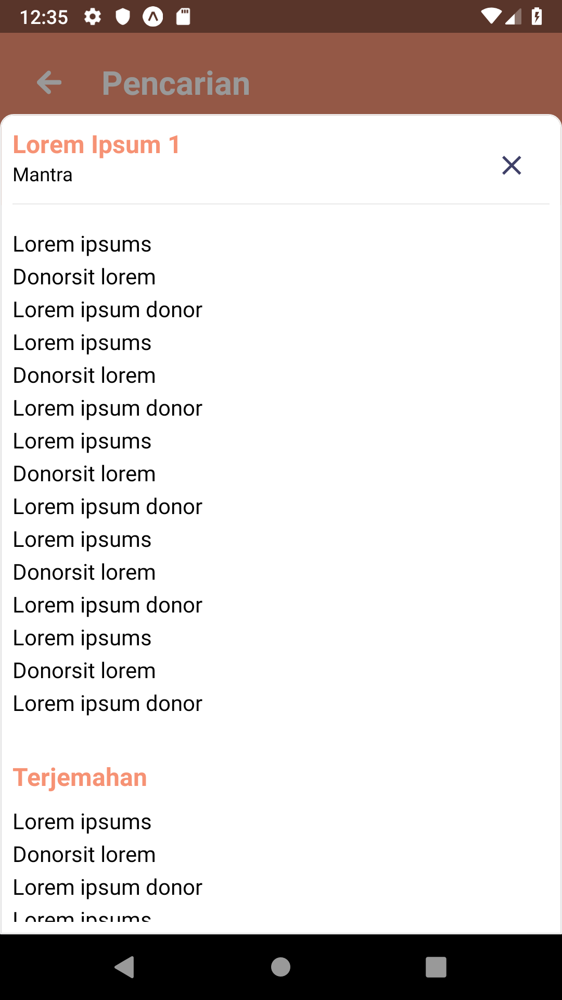

# React Native Custom Bottom Sheet
Bottom sheet component with any view and smooth animation for React Native.

# Install
`npm i react-native-custom-bottom-sheet`

# Props

**visible**: *Boolean* <br />
Bottom sheet visibility

**height**: *Number* <br />
To control the height of the bottom sheet when visible.

**onVisibilityChange**: *Function* <br />
Callback to show/ hide the visibility of the bottom sheet.

**children**: *Any Component* <br />
Component you want to show inside the bottom sheet. <br/>
`<CustomBottomSheet> <AnyComponent/> </CustomBottomSheet>`

# Example
```
state = {
  visibility: true
}

const handleVisibility = (visibility) => {
  this.setState({ 
    visibility
  })
}

render() {
  return (
  <View>
    <CustomBottomSheet
      visible={this.state.visibility}
      onVisibilityChange={this.handleVisibility}
      height={100}
     >
      <Text>Hello World</Text> 
    </CustomBottomSheet>
  </View>
  )
}
```

# Screenshot

